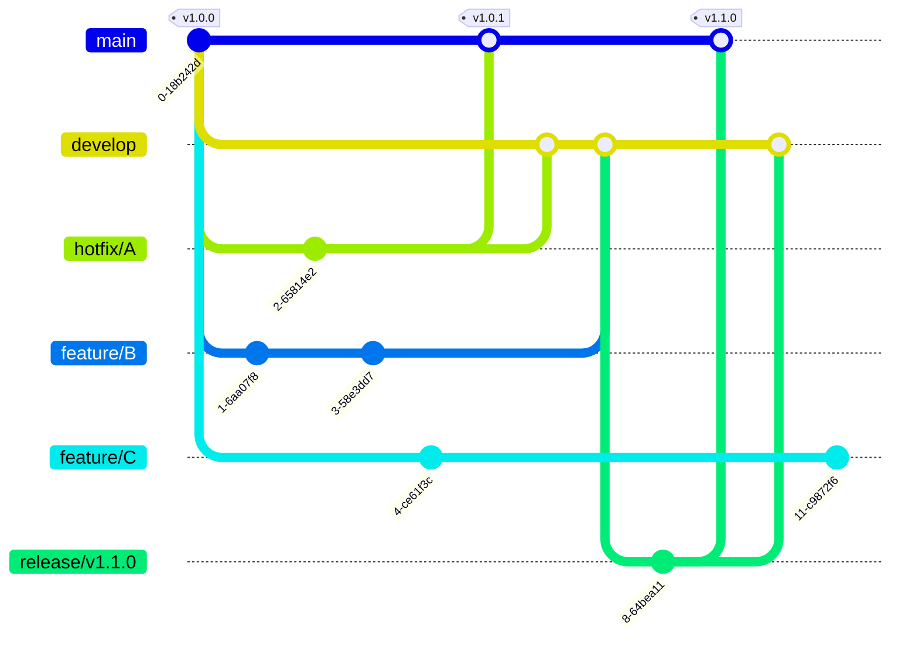

# DEVELOPERS

## Development Setup

todo

## Git Rules

### Branch

#### Main Branches

| branch    | description                                                                                                                                                                                                                                |
| --------- | ------------------------------------------------------------------------------------------------------------------------------------------------------------------------------------------------------------------------------------------ |
| `main`    | The production-ready branch that always reflects the latest released version. Only stable and tested code is merged into `main`, typically from `release` or `hotfix` branches. Tags for production releases are created from this branch. |
| `develop` | The integration branch for ongoing development. All feature branches are created from and merged back into `develop`. It reflects the latest completed development work that is ready for staging or further testing.                      |

#### Supporting Branches

| branch    | description                                                                                                                                                                                                                                                                                          | example                  |
| --------- | ---------------------------------------------------------------------------------------------------------------------------------------------------------------------------------------------------------------------------------------------------------------------------------------------------- | ------------------------ |
| `feature` | Used for developing new features or enhancements that are planned for a future release. A `feature` branch is created from the `develop` branch.                                                                                                                                                     | `feature/registration`   |
| `hotfix`  | Used for immediate patches to the production (`main`) branch to fix critical bugs. A `hotfix` branch is created from the `main` branch. After applying the fix, the branch should be merged into both `main` and `develop`.                                                                          | `hotfix/fix-login-crash` |
| `release` | Used to prepare for a production release by finalizing versioning, testing, and minor bug fixes. A `release` branch is created from `develop` when the development for a new version is feature-complete. It serves as a staging branch. The branch should be merged into both `main` and `develop`. | `release/v1.0.0`         |

#### Git Graph



### Commit Message

#### Format

```plaintext
<type>: <subject>
<BLANK>
<body>
```

Write commit messages in English.

#### Type

| type     | description                                                                                            |
| -------- | ------------------------------------------------------------------------------------------------------ |
| build    | Changes that affect the build system or external dependencies                                          |
| feat     | A new feature                                                                                          |
| fix      | A bug fix                                                                                              |
| docs     | Documentation only changes                                                                             |
| style    | Changes that do not affect the meaning of the code (white-space, formatting, missing semi-colons, etc) |
| refactor | A code change that neither fixes a bug nor adds a feature                                              |
| perf     | A code change that improves performance                                                                |
| test     | Adding missing or correcting existing tests                                                            |
| chore    | Changes to the build process or auxiliary tools and libraries such as documentation generation         |

#### Subject

Summarize the commit content concisely in the first line (Subject Line).

ex.

```plaintext
fix: resolve issue with user authentication
```

#### Body

After the Subject Line, add a blank line and describe the details.

ex.

```plaintext
fix: resolve issue with user authentication

The user authentication process was failing due to an incorrect database query.
This commit corrects the query and resolves the issue.

Affected components:
- User authentication module
- Database connection
```
